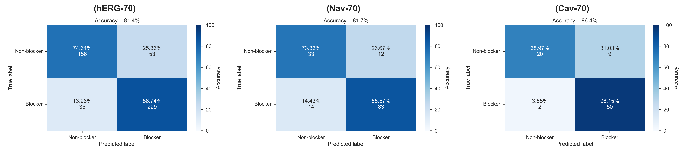
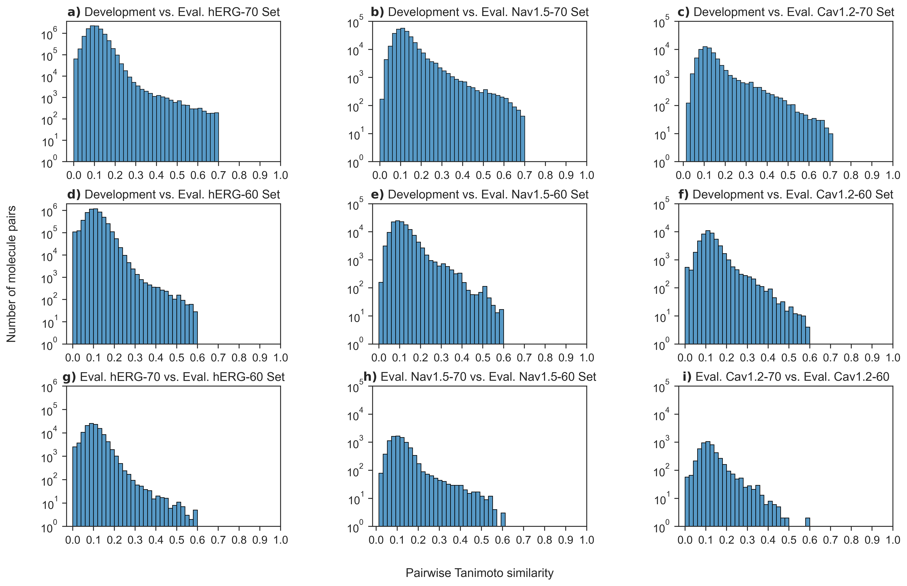
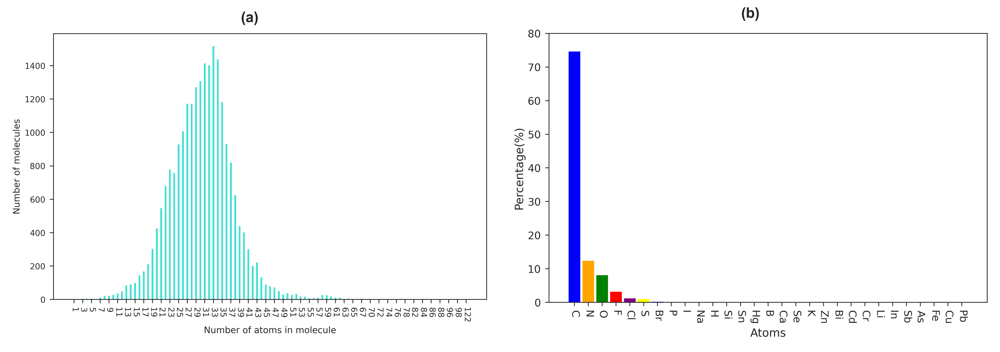
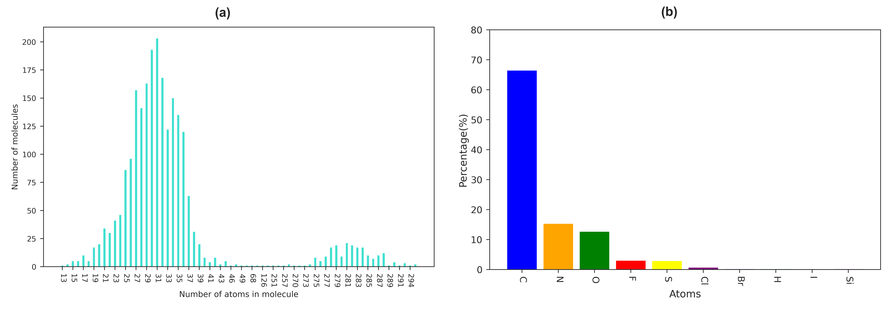

# CToxPred
Comprehensive cardiotoxicity prediction tool of small molecules on three targets: hERG, Nav1.5, Cav1.2

	

:exclamation:Clone first the whole repository package and follow the steps bellow.

## Prerequisites
1- Create and activate a conda environment:

		$conda create -n ctoxpred python=3.7
		$conda activate ctoxpred

2- Install packages:

		$bash install.sh

3- Clone the repository: 

		$git clone git@github.com:issararab/CToxPred.git

4- Move to the repository:

		$cd CToxPred

5- Run test:

		$python CToxPred.py data/test_smiles_list.smi
  
The software saves the predictions to a CSV file named 'predictions.csv'

## Hot stuff
- Distribution of the pairwise Tanimoto similarity for each molecule in the datasets used for training and model evaluation

	

 
- Distributions of the 8 physicochemical properties between inhibitor(blocker) and inactive(non-blocker) compounds in the hERG dataset

	

- Atom composition analysis of molecules in our hERG development set. (a) represents a distribution of the total number of atoms in each molecule with a mean of around 33, while (b) showcases the atom composition distribution of the dataset
  

	

- Atom composition analysis of molecules in our Nav1.5 development set. (a) represents a distribution of the total number of atoms in each molecule with a mean of around 35, while (b) showcases the atom composition distribution of the dataset
  

	

