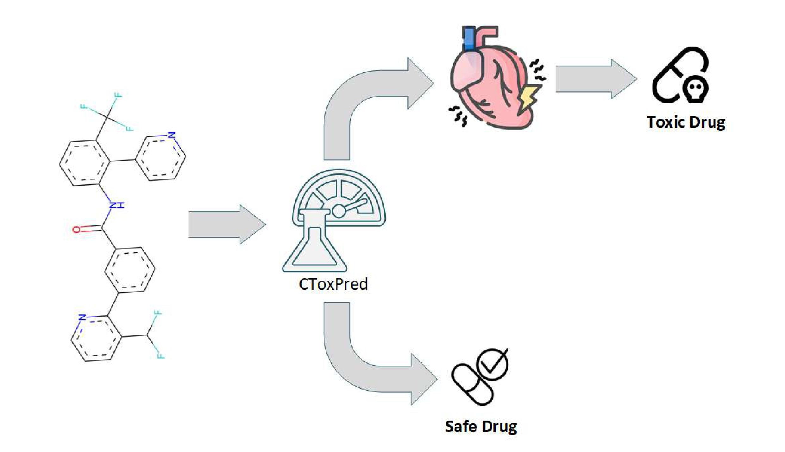

# CToxPred
Comprehensive cardiotoxicity prediction tool of small molecules on three targets: hERG, Nav1.5, Cav1.2

	

:exclamation:Clone first the whole repository and follow the steps bellow.

## Publications
If you use CToxPred in your work, please cite the following publications:

- Issar Arab, Kristof Egghe, Kris Laukens, Ke Chen, Khaled Barakat, Wout Bittremieux, **Benchmarking of Small Molecule Feature Representations for hERG, Nav1.5, and Cav1.2 Cardiotoxicity Prediction**, _Journal of Chemical Information and Modeling_, (2023). [doi:10.1021/acs.jcim.3c01301](https://doi.org/10.1021/acs.jcim.3c01301)

- Issar Arab, Kris Laukens, Wout Bittremieux, **Semisupervised Learning to Boost hERG, Nav1.5, and Cav1.2 Cardiac Ion Channel Toxicity Prediction by Mining a Large Unlabeled Small Molecule Data Set**, _Journal of Chemical Information and Modeling_, (2024). [doi.org/10.1021/acs.jcim.3c01301](https://doi.org/10.1021/acs.jcim.4c01102)

## Prerequisites
1- Create and activate a conda environment:

		$conda create -n ctoxpred python=3.7
		$conda activate ctoxpred
  
2- Clone the repository: 

		$git clone git@github.com:issararab/CToxPred.git

3- Move to the repository:

		$cd CToxPred

4- Install packages:

		$bash install.sh

5- Run test:

		$python CToxPred.py data/test_smiles_list.smi
  
The software saves the predictions to a CSV file named 'predictions.csv'

## Data availability

To re-train the models, re-evaluate the models using the same test sets, or re-run the analysis notebook, fetch first the database deposited for public use on Zenodo ([https://zenodo.org/record/8245086](https://zenodo.org/records/8359714)), copy the uncompressed folder in the "data" folder, then run the notebooks.

## Hot stuff
- Distribution of the pairwise Tanimoto similarity for each molecule in the datasets used for training and model evaluation

	

 
- Distributions of the 8 physicochemical properties between inhibitor(blocker) and inactive(non-blocker) compounds in the hERG dataset

	

- Confusion matrix for the performance of CToxPred on all three cardiac ion channels
  

	

